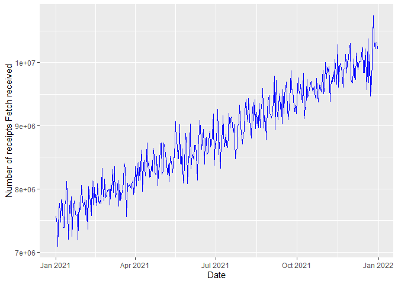

# Goal

This is an R Markdown document. Markdown is a simple formatting syntax
for authoring HTML, PDF, and MS Word documents. For more details on
using R Markdown see <http://rmarkdown.rstudio.com>.

This document provides a walk through of analysing Fetch’s data and the
steps taken for statistical modelling.

## Loading data

Let’s load all the required for this project:

Below is an overview of the data:

``` r
fetch_daily_receipt_count_df <- read.csv('Data/data_daily.csv')
head(fetch_daily_receipt_count_df)
```

    ##      X..Date Receipt_Count
    ## 1 2021-01-01       7564766
    ## 2 2021-01-02       7455524
    ## 3 2021-01-03       7095414
    ## 4 2021-01-04       7666163
    ## 5 2021-01-05       7771289
    ## 6 2021-01-06       7473320

Let’s do some data pre-processing and data cleaning:

``` r
#Formatting column names to lowercase.
names(fetch_daily_receipt_count_df) <- tolower(names(fetch_daily_receipt_count_df))

# Rename the "# date" column to "date_receipt_count"
names(fetch_daily_receipt_count_df)[1] <- "date_of_receipt_count"

head(fetch_daily_receipt_count_df)
```

    ##   date_of_receipt_count receipt_count
    ## 1            2021-01-01       7564766
    ## 2            2021-01-02       7455524
    ## 3            2021-01-03       7095414
    ## 4            2021-01-04       7666163
    ## 5            2021-01-05       7771289
    ## 6            2021-01-06       7473320

Let’s check the data types of the columns:

``` r
str(fetch_daily_receipt_count_df)
```

    ## 'data.frame':    365 obs. of  2 variables:
    ##  $ date_of_receipt_count: chr  "2021-01-01" "2021-01-02" "2021-01-03" "2021-01-04" ...
    ##  $ receipt_count        : int  7564766 7455524 7095414 7666163 7771289 7473320 7832624 7765028 7385245 7392087 ...

For further analysis, we need to convert the ‘date_of_receipt_count’
column to Date data type.

``` r
fetch_daily_receipt_count_df$date_of_receipt_count <- as.Date(fetch_daily_receipt_count_df$date_of_receipt_count)
str(fetch_daily_receipt_count_df)
```

    ## 'data.frame':    365 obs. of  2 variables:
    ##  $ date_of_receipt_count: Date, format: "2021-01-01" "2021-01-02" ...
    ##  $ receipt_count        : int  7564766 7455524 7095414 7666163 7771289 7473320 7832624 7765028 7385245 7392087 ...

Let’s check for any missing values:

``` r
#Checking for missing values
sum(is.na(fetch_daily_receipt_count_df))
```

    ## [1] 0

Our dataset now looks clean and ready for analysis.

``` r
head(fetch_daily_receipt_count_df)
```

    ##   date_of_receipt_count receipt_count
    ## 1            2021-01-01       7564766
    ## 2            2021-01-02       7455524
    ## 3            2021-01-03       7095414
    ## 4            2021-01-04       7666163
    ## 5            2021-01-05       7771289
    ## 6            2021-01-06       7473320

``` r
summary(fetch_daily_receipt_count_df)
```

    ##  date_of_receipt_count receipt_count     
    ##  Min.   :2021-01-01    Min.   : 7095414  
    ##  1st Qu.:2021-04-02    1st Qu.: 8142874  
    ##  Median :2021-07-02    Median : 8799249  
    ##  Mean   :2021-07-02    Mean   : 8826566  
    ##  3rd Qu.:2021-10-01    3rd Qu.: 9476970  
    ##  Max.   :2021-12-31    Max.   :10738865

# Exploratory Data Analysis

Let’s first plot our time series dataset and get an overview of the
situation.

``` r
#Plotting
library(ggplot2)
graph_plot <- ggplot(data = fetch_daily_receipt_count_df, aes(x = date_of_receipt_count,
                                                              y = receipt_count))
graph_plot <- graph_plot + geom_line(color = 'blue') + labs(x = 'Date',
                                                            y = 'Number of receipts Fetch received')
graph_plot
```



## Understanding Time Series Regression Analysis

Understanding the relationship between variables and how they evolve
over time is crucial when constructing an accurate prediction model.

A time series relationship can be decomposed as follows:

$$series = trend + seasonality + cycles + error$$

### *Trend*

Variables may oscillate around a ***stable*** <ins>*average value*</ins>, or
they may have an <ins>*overall tendency*</ins> to either go ***downwards***
or ***upwards***.

This overall direction in which variables move is called ***trend***.
